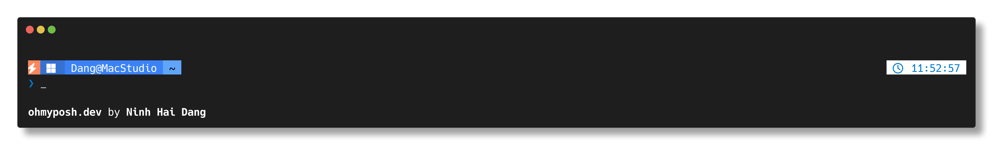

# Lighthouse Oh My Posh Theme

> **English** | [Tiếng Việt](#tiếng-việt)

> A clean and elegant Oh My Posh theme for developers - Lighthouse by Ninh Hai Dang



## ✨ Features

- **Clean and Modern Design**: Minimal yet informative prompt layout
- **Multi-Language Support**: Automatic detection and display for:
  - .NET Core
  - Go
  - Python
  - Rust
  - Node.js
  - TypeScript
  - Java
  - C/C++
  - PHP
  - Docker
- **Git Integration**: Branch name and status display
- **System Information**: OS, user, hostname, and SSH session indicators
- **Execution Time**: Shows command execution time for long-running commands
- **Real-time Clock**: Current time display
- **Error Status**: Visual indication of command exit codes
- **Root Privileges**: Special indicator when running as administrator/root

## 🎨 Theme Structure

The theme consists of three main blocks:

### Left Block (Main Prompt)

- **Error Status**: Red indicator when previous command failed
- **Root Indicator**: Orange lightning bolt when running with elevated privileges
- **OS Icon**: Operating system indicator with WSL support
- **Session Info**: Username and hostname with SSH session indicator
- **Current Path**: Full directory path with elegant separators
- **Git Branch**: Current branch with intuitive icons
- **Language Runtimes**: Auto-detected programming language versions

### Right Block (Status Info)

- **Execution Time**: Shows duration for commands taking >321ms
- **Current Time**: Real-time clock in HH:MM:SS format

### Bottom Block (Shell Prompt)

- **Shell Indicator**: Custom symbols for different shells (PowerShell, Bash, Zsh, etc.)

## 🚀 Installation

### Prerequisites

- [Oh My Posh](https://ohmyposh.dev/docs/installation/windows) installed on your system
- A [Nerd Font](https://www.nerdfonts.com/) for proper icon display

### Setup Environment (Optional)

If you're using conda, disable the default environment prompt to avoid conflicts with Oh My Posh:

```bash
conda config --set changeps1 False
```

### Quick Install

1. Download the theme file:

```powershell
# Windows PowerShell/Command Prompt
curl -o lighthouse.omp.json https://raw.githubusercontent.com/yourusername/lighthouse-omp-theme/main/lighthouse.omp.json

# Or using Invoke-WebRequest in PowerShell
Invoke-WebRequest -Uri "https://raw.githubusercontent.com/yourusername/lighthouse-omp-theme/main/lighthouse.omp.json" -OutFile "lighthouse.omp.json"
```

2. Set the theme:

```powershell
# Temporary (current session only)
oh-my-posh init pwsh --config ./lighthouse.omp.json | Invoke-Expression

# Permanent (add to your PowerShell profile)
oh-my-posh init pwsh --config ./lighthouse.omp.json
```

### Manual Installation

1. Clone or download this repository
2. Copy `lighthouse.omp.json` to your Oh My Posh themes directory
3. Update your shell profile to use the theme

#### PowerShell Profile Setup

Add this line to your PowerShell profile (`$PROFILE`):

```powershell
oh-my-posh init pwsh --config "path/to/lighthouse.omp.json" | Invoke-Expression
```

#### Bash/Zsh Profile Setup

Add this line to your `.bashrc` or `.zshrc`:

```bash
eval "$(oh-my-posh init bash --config path/to/lighthouse.omp.json)"
# or for zsh
eval "$(oh-my-posh init zsh --config path/to/lighthouse.omp.json)"
```

## 🎯 Customization

The theme is highly customizable. You can modify colors, segments, and behavior by editing the `lighthouse.omp.json` file:

### Color Scheme

- **Primary Blue**: `#007ACC` - Git and time indicators
- **Light Blue**: `#3571d1`, `#3B82F6`, `#60A5FA` - System info gradients
- **Error Red**: `#880000` - Error status background
- **Success Colors**: Various colors for different programming languages

### Adding New Segments

To add new segments, modify the `segments` array in the JSON file. Refer to the [Oh My Posh documentation](https://ohmyposh.dev/docs/segments/overview) for available segment types.

## 🛠️ Troubleshooting

### Icons Not Displaying Correctly

- Install a [Nerd Font](https://www.nerdfonts.com/) (recommended: FiraCode Nerd Font, JetBrains Mono Nerd Font)
- Set your terminal to use the Nerd Font

### Theme Not Loading

- Verify Oh My Posh is installed: `oh-my-posh --version`
- Check the JSON file syntax is valid
- Ensure the path to the theme file is correct

### Performance Issues

- The theme fetches version information for detected languages
- To improve performance, set `fetch_version: false` for unused language segments

## 📝 License

This theme is open source and available under the [MIT License](LICENSE).

## 🤝 Contributing

Contributions are welcome! Please feel free to submit a Pull Request. For major changes, please open an issue first to discuss what you would like to change.

## 👤 Author

**Ninh Hai Dang**

- Theme Designer and Developer

## 🙏 Acknowledgments

- [Oh My Posh](https://ohmyposh.dev/) - The amazing prompt engine
- [Nerd Fonts](https://www.nerdfonts.com/) - For the beautiful icons
- The Oh My Posh community for inspiration and feedback

---

_If you like this theme, please consider giving it a ⭐ star!_

---

# Tiếng Việt

# Lighthouse Oh My Posh Theme

> Theme Oh My Posh gọn gàng và thanh lịch cho các nhà phát triển - Lighthouse của Ninh Hải Đăng


## ✨ Tính năng nổi bật

- **Giao diện gọn gàng và hiện đại**: Layout prompt tối giản nhưng thông tin đầy đủ
- **Hỗ trợ nhiều ngôn ngữ lập trình**: Tự động nhận diện và hiển thị:
  - .NET Core
  - Go
  - Python
  - Rust
  - Node.js
  - TypeScript
  - Java
  - C/C++
  - PHP
  - Docker
- **Tích hợp Git**: Hiển thị tên nhánh và trạng thái repository
- **Thông tin hệ thống**: Hiển thị OS, tên người dùng, hostname và phiên SSH
- **Thời gian thực thi**: Hiển thị thời lượng thực thi cho các lệnh chạy lâu
- **Đồng hồ thời gian thực**: Hiển thị giờ hiện tại
- **Thông báo lỗi**: Hiển thị trực quan khi lệnh thực thi có lỗi
- **Quyền quản trị**: Chỉ báo đặc biệt khi chạy với quyền quản trị/root

## 🎨 Cấu trúc theme

Theme gồm ba khối chính:

### Khối bên trái (Prompt chính)

- **Thông báo lỗi**: Chỉ báo màu đỏ khi lệnh trước đó thất bại
- **Chỉ báo quyền quản trị**: Biểu tượng tia chớp màu cam khi chạy với quyền Admin
- **Biểu tượng hệ điều hành**: Hiển thị OS với hỗ trợ WSL
- **Thông tin phiên làm việc**: Tên người dùng và hostname, báo hiệu khi kết nối SSH
- **Đường dẫn hiện tại**: Hiển thị đường dẫn thư mục đầy đủ với ký tự phân cách đẹp mắt
- **Nhánh Git**: Nhánh hiện tại với các biểu tượng trực quan
- **Môi trường ngôn ngữ**: Tự động phát hiện và hiển thị phiên bản ngôn ngữ lập trình

### Khối bên phải (Thông tin trạng thái)

- **Thời gian thực thi**: Hiển thị thời lượng cho các lệnh mất trên 321ms
- **Đồng hồ thời gian thực**: Hiển thị giờ theo định dạng HH:MM:SS

### Khối dưới cùng (Dấu nhắc shell)

- **Ký hiệu shell**: Biểu tượng tùy chỉnh cho từng loại shell (PowerShell, Bash, Zsh, v.v.)

## 🚀 Hướng dẫn cài đặt

### Yêu cầu hệ thống

- [Oh My Posh](https://ohmyposh.dev/docs/installation/windows) đã được cài đặt
- [Nerd Font](https://www.nerdfonts.com/) để hiển thị biểu tượng đúng cách

### Thiết lập môi trường (Tùy chọn)

Nếu bạn đang sử dụng conda, hãy tắt prompt môi trường mặc định để tránh xung đột với Oh My Posh:

```bash
conda config --set changeps1 False
```

### Cài đặt nhanh

1. Tải xuống file theme:

```powershell
# Windows PowerShell/Command Prompt
curl -o lighthouse.omp.json https://raw.githubusercontent.com/yourusername/lighthouse-omp-theme/main/lighthouse.omp.json

# Hoặc dùng Invoke-WebRequest trong PowerShell
Invoke-WebRequest -Uri "https://raw.githubusercontent.com/yourusername/lighthouse-omp-theme/main/lighthouse.omp.json" -OutFile "lighthouse.omp.json"
```

2. Áp dụng theme:

```powershell
# Sử dụng tạm thời (chỉ trong phiên hiện tại)
oh-my-posh init pwsh --config ./lighthouse.omp.json | Invoke-Expression

# Sử dụng vĩnh viễn (thêm vào PowerShell profile)
oh-my-posh init pwsh --config ./lighthouse.omp.json
```

### Cài đặt thủ công

1. Tải về hoặc clone repository này
2. Sao chép file `lighthouse.omp.json` vào thư mục themes của Oh My Posh
3. Cập nhật profile của shell để sử dụng theme

#### Thiết lập cho PowerShell

Thêm dòng sau vào PowerShell profile (`$PROFILE`):

```powershell
oh-my-posh init pwsh --config "đường/dẫn/tới/lighthouse.omp.json" | Invoke-Expression
```

#### Thiết lập cho Bash/Zsh

Thêm dòng sau vào file `.bashrc` hoặc `.zshrc`:

```bash
eval "$(oh-my-posh init bash --config đường/dẫn/tới/lighthouse.omp.json)"
# hoặc cho zsh
eval "$(oh-my-posh init zsh --config đường/dẫn/tới/lighthouse.omp.json)"
```

## 🎯 Tùy chỉnh theme

Theme có khả năng tùy chỉnh cao. Bạn có thể thay đổi màu sắc, các thành phần và hành vi bằng cách chỉnh sửa file `lighthouse.omp.json`:

### Bảng màu chủ đạo

- **Xanh dương chính**: `#007ACC` - Dùng cho Git và đồng hồ
- **Xanh dương nhạt**: `#3571d1`, `#3B82F6`, `#60A5FA` - Gradient cho thông tin hệ thống
- **Đỏ lỗi**: `#880000` - Nền cho thông báo lỗi
- **Màu đa dạng**: Nhiều màu khác nhau cho từng ngôn ngữ lập trình

### Thêm thành phần mới

Để thêm thành phần mới, chỉnh sửa mảng `segments` trong file JSON. Tham khảo [tài liệu Oh My Posh](https://ohmyposh.dev/docs/segments/overview) để biết các loại thành phần có sẵn.

## 🛠️ Khắc phục sự cố

### Biểu tượng không hiển thị đúng

- Cài đặt [Nerd Font](https://www.nerdfonts.com/) (khuyến nghị: FiraCode Nerd Font, JetBrains Mono Nerd Font)
- Thiết lập terminal để sử dụng Nerd Font

### Theme không tải được

- Kiểm tra Oh My Posh đã cài đặt: `oh-my-posh --version`
- Kiểm tra cú pháp file JSON có hợp lệ không
- Đảm bảo đường dẫn tới file theme chính xác

### Vấn đề về hiệu suất

- Theme sẽ lấy thông tin phiên bản của các ngôn ngữ được phát hiện
- Để cải thiện hiệu suất, có thể thiết lập `fetch_version: false` cho các ngôn ngữ không sử dụng

## 📝 Giấy phép

Theme này là mã nguồn mở và được cung cấp theo [Giấy phép MIT](LICENSE).

## 🤝 Đóng góp

Rất hoan nghênh các đóng góp! Vui lòng gửi Pull Request. Đối với những thay đổi lớn, hãy tạo issue trước để thảo luận về những gì bạn muốn thay đổi.

## 👤 Tác giả

**Ninh Hải Đăng**

- Thiết kế và phát triển theme

## 🙏 Lời cảm ơn

- [Oh My Posh](https://ohmyposh.dev/) - Engine prompt tuyệt vời
- [Nerd Fonts](https://www.nerdfonts.com/) - Cung cấp những biểu tượng đẹp
- Cộng đồng Oh My Posh vì sự cảm hứng và phản hồi

---

_Nếu bạn thích theme này, hãy cho một ⭐ ngôi sao nhé!_
